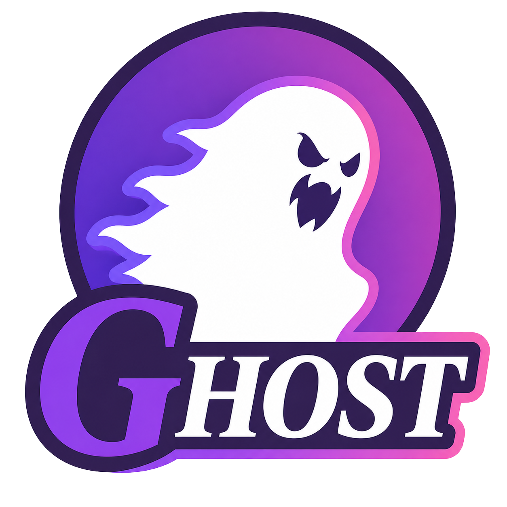

# Ghost



Ghost is a small macOS menu-bar overlay that shows you the next characters
of a saved passage in the corner of every screen, advancing one keystroke
at a time as you type into the focused window. Think of it as a
teleprompter for typing.

You paste a passage into Ghost's snippet library, hit start, and a faint,
draggable strip appears in the bottom-right corner of every Space
(including over native fullscreen apps). The strip slides forward one
character per correct keystroke, with a small progress ring tracking how
far you've gone. Ghost never steals focus, so you stay in your editor,
browser, or email client, wherever the typing is actually going.

- **Reference always in view**: a small frosted strip floats over every
  Space and over fullscreen apps, sliding forward one character per
  correct keystroke. The text never leaves your peripheral vision and
  you never lose your place in the source.
- **Forgiving resync**: skip a word, swap one in ("happily" for
  "quickly"), insert a phrase, or paraphrase. Ghost looks at your last
  few keystrokes and snaps the cursor forward to the closest matching
  point in the snippet, so a small detour does not put you back at zero.
- **Snippet library**: paste passages into the menu-bar editor, organize
  them, or load straight from your clipboard for one-shot use.
  Everything stays local to your Mac.
- **Free and Open Source**: Ghost is licensed under the MIT License.

- **[Installation](#installation)**
- **[Configuration](#configuration)**
- **[Getting Started](#getting-started)**
- **[Use Cases](#use-cases)**
- **[FAQ](#faq)**

## Installation

Down below you will find basic installation instructions for several common
setups. The one-liner is the recommended path for most users.

### One-line install
<details>
<summary>Toggle instructions</summary>

```
curl -fsSL https://raw.githubusercontent.com/TeXtUtility/Ghost/main/install.sh | bash
```

This will:

- install the Xcode Command Line Tools (if missing)
- clone the repo to `~/Ghost`
- generate a stable self-signed code-signing certificate in your login
  keychain (so the macOS Accessibility grant persists across rebuilds)
- build and install `Ghost.app` to `~/Applications/`
- launch the app

Re-run any time to update or repair the installation.
</details>

### From source
<details>
<summary>Toggle instructions</summary>

```
git clone https://github.com/TeXtUtility/Ghost.git
cd Ghost
./scripts/setup_dev_cert.sh    # one-time, see note below
./scripts/build_app.sh          # build + install ~/Applications/Ghost.app
open ~/Applications/Ghost.app
```

Requires macOS 14 or later. Swift 6 ships with the Xcode Command Line
Tools (install via `xcode-select --install` if not present).

`setup_dev_cert.sh` is a one-time step that creates a stable self-signed
code-signing cert in your login keychain. macOS keys Accessibility grants
by the binary's "designated requirement", which changes on every ad-hoc
rebuild; signing with a fixed cert keeps it stable so you only have to
grant Ghost Accessibility once.
</details>

### Running from the package without installing
<details>
<summary>Toggle instructions</summary>

For development you can run Ghost straight from the source tree:

```
swift run
```

This produces a binary outside the bundled `.app`. Its Accessibility
grant is separate from any installed `.app` and resets on each rebuild.
Use `./scripts/build_app.sh` instead if you want a stable, persistent
install that survives rebuilds.
</details>

### Without the Command Line Tools
<details>
<summary>Toggle instructions</summary>

You need a Swift 6 toolchain to build Ghost. Two options:

1. Install the Xcode Command Line Tools: `xcode-select --install`. This
   is a smaller download and is sufficient for `swift build` and
   `swift run`.
2. Install full Xcode from the App Store. Required only if you want an
   Xcode project to edit Ghost in.

Once a toolchain is in place, follow the **From source** instructions
above.
</details>

## Configuration

Settings (corner, opacity, font size, visible-window length) persist
between sessions in `UserDefaults` under the bundle id
`com.textutility.ghost`. Most are adjustable on the fly with keyboard
shortcuts, listed below. To wipe all settings and snippets:

```
defaults delete com.textutility.ghost
```

Keyboard shortcuts use the `Control + Option + Command` modifier triple,
chosen so they never collide with whatever app you are typing into.

| Combo                    | Action                                                                  |
| ------------------------ | ----------------------------------------------------------------------- |
| `⌃⌥⌘ ←` / `→`             | Picker: previous / next snippet. Typing: previous / next word.          |
| `⌃⌥⌘ Return`              | Picker: confirm selection and start typing.                             |
| `⌃⌥⌘ Esc`                 | Typing: back to picker. Picker: hide overlay.                           |
| `⌃⌥⌘ B`                   | Typing: back to picker (alternate to Esc).                              |
| `⌃⌥⌘ +` or `=`            | Scale the overlay up.                                                   |
| `⌃⌥⌘ -`                   | Scale the overlay down.                                                 |
| `⌃⌥⌘ 0`                   | Snap overlay back to its default position in the bottom-right corner.   |

The overlay is also draggable: click and hold anywhere on it and move it
to wherever feels least intrusive.

## Getting Started

On first launch macOS will prompt for **Accessibility** permission, which
Ghost uses to read keystrokes from whichever app you are typing into.
Grant it in System Settings, Privacy & Security, Accessibility, then quit
and relaunch Ghost. The popover surfaces an in-app prompt with the right
buttons if you miss this step.

A small white dot appears in the menu bar:

1. **Left-click** the dot to open the snippet library popover.
2. **Paste** the passage you want to type into the editor on the right
   (or click *Paste from clipboard*).
3. Click **Use**, or close the popover and use the picker.
4. Switch to your editor, browser, or email client. The overlay should be
   sitting in the bottom-right of your screen showing the first few
   characters of the passage.
5. Start typing. The overlay scrolls along.

## Getting Help

Before opening a new issue, please search the existing ones to see if
your question is already covered. For bug reports, questions, and
feature suggestions, please use the [issue tracker][issues] on GitHub.

## Use Cases

A handful of ways Ghost has been useful:

- **Practicing typing on real text**: typing-test sites give you random
  pangrams. Ghost lets you practice on whatever you actually need to
  type, the opening of a paper you are rereading, a paragraph from a
  book, vocabulary for a language you are learning.
- **Reducing split attention**: keeping reference text in your peripheral
  vision instead of alt-tabbing between two windows. Useful if switching
  context between a source and a destination is taxing or slow for you.
- **Transcribing physical media**: typing out a paragraph from a paper
  book or a printed sheet without lifting your eyes (the next character
  is always in the corner).
- **Speech and presentation rehearsal**: type your script repeatedly to
  commit it to memory. The corner cue keeps you on track while you build
  muscle memory.
- **Foreign-language drills**: type passages with the source visible in
  the corner so you can focus on hand position rather than scrolling
  back to the source.

## FAQ

### Why does Ghost need Accessibility permission?

Ghost reads keystrokes from the focused app to know when you have typed
the next character of the snippet. Reading global keystrokes requires
Accessibility on macOS. Ghost only observes keys; it never injects them
or modifies them.

### Does it work over fullscreen apps?

Yes. The overlay floats over every Space, including other apps' native
fullscreen, by setting its window level to `.screenSaver` and its
`collectionBehavior` to `[.canJoinAllSpaces, .fullScreenAuxiliary,
.stationary, .ignoresCycle]`.

### Why does it stop working in password fields?

Password fields and Terminal windows with Secure Keyboard Entry enabled
prevent global key monitors from observing input. This is a hard macOS
limit, not something Ghost can work around. Ghost will not advance while
focus is in such a field.

### Where are my snippets stored?

In `UserDefaults` under the bundle id `com.textutility.ghost`. Persistent
storage to a JSON file in `~/Library/Application Support/Ghost/` is
planned.

### Why does my Accessibility grant break after a rebuild?

It does not, if you ran `./scripts/setup_dev_cert.sh` once. macOS keys
TCC entries by the binary's "designated requirement". An ad-hoc signature
changes every build, but the stable self-signed cert keeps the DR
constant across rebuilds, so the grant persists. If you skipped the cert
step, `build_app.sh` will tell you so on first build.

## Contributing

To report bugs and suggest features, use the [issue tracker][issues]. If
you have code to contribute, open a pull request. Small, focused changes
are easier to review and land. See [CONTRIBUTING.md](CONTRIBUTING.md) for
a few conventions.

## License

Copyright © TeXtUtility contributors. Distributed under the MIT License.
See [LICENSE](LICENSE) for the full text.

[issues]: https://github.com/TeXtUtility/Ghost/issues
